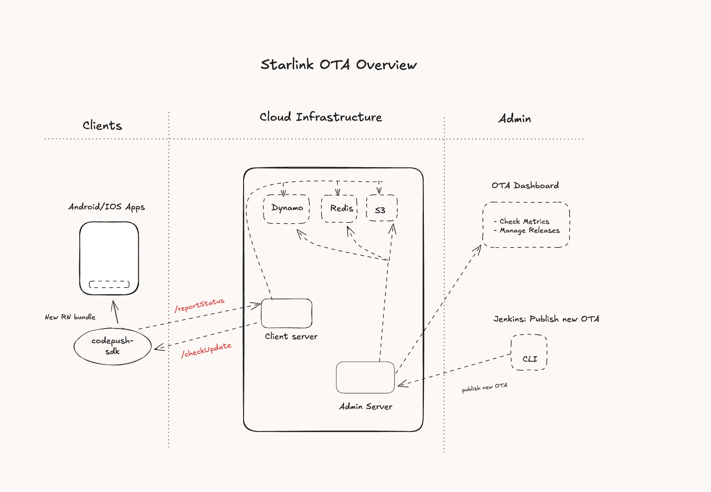

# Starlink OTA Server

[](LICENSE.txt) <!-- Replace with your actual license badge -->

An extended, self-hosted CodePush server designed for robust and scalable Over-the-Air (OTA) updates for mobile applications. This project builds upon the foundation of Microsoft's CodePush server, providing an AWS-centric backend implementation (DynamoDB, S3, Redis) while maintaining extensibility for other cloud providers. It has been battle-tested in production environments, powering updates for applications like My11Circle.



## Overview

This CodePush server allows developers to instantly deploy mobile application updates directly to users' devices without waiting for app store approvals. It provides the backend infrastructure necessary for the `react-native-code-push` client SDK (and potentially other CodePush-compatible SDKs) to check for and download updates.

The system comprises:

- **Client Server**: Handles requests from mobile applications (`/checkUpdate`, `/reportStatus`).
- **Admin Server**: Manages releases, metrics, and configurations, used by the CLI and OTA Dashboard.
- **CLI**: A command-line tool for developers to publish new updates and manage applications.
- **OTA Dashboard**: A React-based web interface for monitoring update metrics, managing releases, and viewing real-time analytics.

## Features

- **Over-the-Air Updates**: Seamlessly deliver updates to React Native, Android, and iOS applications.
- **AWS Integration**: Out-of-the-box support for AWS services:
  - **DynamoDB**: For storing application metadata, deployment information, and release details.
  - **S3**: For storing OTA update bundles.
  - **Redis**: For caching update checks and other frequently accessed data to enhance performance.
- **Extensible Design**: While optimized for AWS, the storage adapter can be extended or replaced to support other cloud providers or on-premise solutions.
- **Client API (`/api`)**: Core server logic providing endpoints for the CodePush SDK.
- **Command-Line Interface (`/cli`)**: Powerful CLI for developers to manage apps, deployments, and releases.
- **OTA Dashboard (`/dashboard`)**: Modern React-based web interface with real-time metrics, release management, and analytics.
- **Metrics & Release Management**: Track deployment success/failure rates and manage release history (facilitated by the Admin Server and OTA Dashboard).
- **Scalable Architecture**: Designed to handle a large number of devices checking for updates.

## Architecture

The system is designed with a distributed architecture, leveraging cloud services for scalability and reliability.

- **Mobile Apps**: Uses the `react-native-code-push` client sdk to connect to the self hosted server.
- **Client Server**: It fetches update information from a **Redis** cache and collects the OTA installation metrics from client apps [APK/IOS].
- **Admin Server**: Handles administrative tasks such as publishing new releases (via the **CLI**) and providing data to the **OTA Dashboard**. It interacts with **S3** to store new bundles and **DynamoDB** to record release metadata.
- **CLI**: Used by developers or CI/CD systems (like **Jenkins**) to publish new OTA updates to the **Admin Server**.
- **OTA Dashboard**: A React-based web interface for viewing deployment metrics, managing releases, and monitoring real-time analytics. It communicates with the **Admin Server** for data and operations.
- **AWS Services**:
  - **DynamoDB**: Stores metadata for apps, deployments, releases, and metrics.
  - **S3**: Hosts the actual OTA update bundles (e.g., JavaScript bundles, assets).
  - **Redis**: Caches frequently accessed data, such as the latest release information for a given app/deployment, to reduce latency and load on DynamoDB.

## Repository Structure

This is a pnpm monorepo that provides several benefits:

- **Unified dependency management**: Shared dependencies are hoisted to reduce duplication
- **Cross-package development**: Easy to develop and test changes across API, CLI, and Dashboard
- **Consistent tooling**: Shared linting, formatting, and build configurations
- **Simplified CI/CD**: Single repository for all components

The monorepo structure is:

```
starlink-ota-server/
├── api/                    # @starlink/api - Core server logic and APIs
├── cli/                    # @starlink/cli - Command-Line Interface
├── dashboard/              # @starlink/dashboard - React-based OTA Dashboard 
```

## Getting Started

### Prerequisites

- Node.js (v18.0.0 or higher recommended)
- pnpm (v8.0.0 or higher) - [Install pnpm](https://pnpm.io/installation)
- Docker and Docker Compose (for local development using AWS service emulators)
- AWS Account (if deploying to AWS or using actual AWS services for development)

### Local Development Setup

1.  **Clone the repository:**

    ```bash
    git clone <your-repository-url>
    cd code-push-server
    ```

2.  **Set up local AWS services (optional, for emulation):**
    This project includes a `docker-compose.yml` at the root to run DynamoDB Local, local S3 (e.g., MinIO or LocalStack), and Redis locally.

    ```bash
    docker-compose up -d
    ```

    Ensure your server configuration (see below) points to these local endpoints.

3.  **Install dependencies for all packages:**

    ```bash
    pnpm install
    ```

    This will install dependencies for the API server, CLI and dashboard using pnpm workspaces.

    **Alternative**: Use the setup script for a complete clean installation:

    ```bash
    ./scripts/setup-monorepo.sh
    ```

    This script will clean existing dependencies, install with pnpm, and build all packages.

4.  **Configure Environment Variables:**
    Both the `api` and `cli` components will require environment variables for configuration (e.g., AWS credentials, database table names, S3 bucket names, Redis connection strings, server ports).
    Create `.env` files in the respective `api` and `cli` directories based on provided `.env.example` files or `ENVIRONMENT.md` documentation (if available).
    For local development with Docker Compose, ensure the AWS access keys/secrets in your `.env` files match what the local services expect (often dummy values are fine for local emulators).

5.  **Build and Run the Server:**
    From the root directory, you can use the following commands:

    ```bash
    # Build all packages
    pnpm build

    # Run the API server in development mode
    pnpm dev

    # Run the Admin server in development mode
    pnpm dev:admin
    ```

    By default, the local CodePush server might run on HTTP. Refer to `api/ENVIRONMENT.md` or specific config files for HTTPS setup if needed.

### Available Commands

The monorepo provides several convenient commands:

```bash
# Build all packages
pnpm build

# Build specific packages
pnpm build:api
pnpm build:cli
pnpm build:dashboard

# Development
pnpm dev                    # Start API server in development mode
pnpm dev:admin              # Start Admin server in development mode
pnpm dev:dashboard          # Start Dashboard in development mode
pnpm dev:dashboard:local    # Start Dashboard with local Admin server

# Testing
pnpm test         # Run tests for all packages
pnpm test:api     # Run API tests only
pnpm test:cli     # Run CLI tests only

# Start services
pnpm start:api        # Start API server
pnpm start:dashboard  # Start Dashboard (production mode)

# Linting and formatting
pnpm lint         # Lint all packages
pnpm lint:fix     # Fix linting issues
pnpm prettier     # Format all code

# Clean build artifacts
pnpm clean        # Clean all packages
```

## Configuration

Detailed configuration options, especially environment variables, should be documented in `api/ENVIRONMENT.md` and potentially `cli/ENVIRONMENT.md` (or a unified document). Key areas to configure include:

- **AWS Credentials & Region**: Access Key, Secret Key, and Region for DynamoDB, S3.
- **DynamoDB Table Names**: Names for tables storing apps, deployments, packages, etc.
- **S3 Bucket Names**: Buckets for storing update bundles and potentially historical data.
- **Redis Connection**: Host, port, password for the Redis cache.
- **Server Ports**: Ports for the Client Server and Admin Server.
- **Authentication**: Configuration for OAuth if the OTA Dashboard or Admin Server requires user authentication.
- **Storage Adapters**: If you plan to use a different cloud provider, you'll need to configure or implement the corresponding storage adapter.

## Usage

### Client SDK Configuration

To make your React Native application use your self-hosted CodePush server, you need to configure it in your app:

**Android:**
In `android/app/src/main/res/values/strings.xml`, add:

```xml
<string moduleConfig="true" name="CodePushServerUrl">YOUR_SERVER_URL</string>
```

Replace `YOUR_SERVER_URL` with the URL of your Client Server (e.g., `http://localhost:3000` for local dev).

**iOS:**
In your `Info.plist` file, add:

```xml
<key>CodePushServerURL</key>
<string>YOUR_SERVER_URL</string>
```

Replace `YOUR_SERVER_URL` with the URL of your Client Server.

### CLI Usage

The CLI is used to manage your CodePush applications, deployments, and releases.

1.  **Build the CLI (if not already built):**

    ```bash
    pnpm --filter @starlink/cli build
    ```

2.  **Use the CLI:**

    ```bash
    # Navigate to the CLI directory
    cd cli

    # Or use pnpm to run CLI commands from root
    pnpm --filter @starlink/cli start -- <command>
    ```

3.  **Common Commands (examples):**

    - Register an app: `node bin/script/cli.js app add <appName> <os> <platform>`
    - List apps: `node bin/script/cli.js app ls`
    - Release an update: `node bin/script/cli.js release-react <appName> <bundlePath> <targetBinaryVersion> --deploymentName <deploymentName>`
    - Promote a release: `node bin/script/cli.js promote <appName> <sourceDeploymentName> <destDeploymentName>`
    - View deployment metrics: `node bin/script/cli.js deployment history <appName> <deploymentName>`

    Refer to `cli/README.md` or `node bin/script/cli.js --help` for detailed CLI commands and options.

### Dashboard Usage

The OTA Dashboard is a modern React-based web interface for managing CodePush deployments.

1.  **Build the Dashboard (if not already built):**

    ```bash
    pnpm --filter @starlink/dashboard build
    ```

2.  **Start the Dashboard:**

    ```bash
    # For local development (connects to local Admin server on port 8080)
    pnpm dev:dashboard:local

    # For staging development (connects to staging Admin server)
    pnpm --filter @starlink/dashboard dev:stage

    # For production build
    pnpm --filter @starlink/dashboard build:prod
    ```

3.  **Access the Dashboard:**

    - Local: `http://localhost:3002`
    - Make sure the Admin Server is running on the appropriate port

4.  **Dashboard Features:**
    - **Apps Management**: List and manage applications, track versions and configurations
    - **Release Management**: Create, monitor, and manage OTA releases across multiple environments
    - **Real-time Metrics**: View download statistics, installation success rates, and device analytics
    - **Version Tracking**: Manage multiple version tracks (v1, v2, v3) per application
    - **Rollout Control**: Configure rollout percentages and mandatory update settings
    - **Device Monitoring**: Track active/inactive devices and installation status

#### Dashboard Technology Stack

The dashboard is built with modern web technologies:

- **Framework**: React 18 with TypeScript
- **Build Tool**: Vite for fast development and optimized builds
- **Styling**: Tailwind CSS with custom components
- **UI Components**: Radix UI primitives for accessibility
- **Routing**: React Router for client-side navigation
- **Forms**: React Hook Form with Zod validation
- **State Management**: React hooks and context
- **Development**: Hot reload, ESLint, Prettier

### API Usage

The API endpoints are primarily consumed by the `react-native-code-push` SDK and the CLI/OTA Dashboard. If you need to interact with the API directly, consult the API route definitions in `api/script/routes/` or any dedicated API documentation.

## Deployment

Deploying this CodePush server to a production environment involves setting up the Client Server and Admin Server, configuring them to use your production AWS resources (DynamoDB, S3, Redis), and ensuring they are scalable and secure.

- **Infrastructure**: Provision your AWS resources (DynamoDB tables with appropriate indexing and capacity, S3 buckets with correct permissions and lifecycle policies, ElastiCache for Redis).
- **Server Deployment**: Deploy the `api` application (which contains both Client and Admin server logic, or they might be separate deployable units) to a hosting platform (e.g., AWS ECS, EKS, EC2, or an App Service like Azure App Service if adapted).
- **Configuration**: Use environment variables to configure the production settings.
- **Load Balancing & Scaling**: Implement load balancing and auto-scaling for the Client Server to handle traffic from numerous devices.
- **Monitoring & Logging**: Set up comprehensive monitoring and logging for all components.
- **Security**: Secure your servers, databases, and storage. Ensure proper authentication and authorization for administrative actions.

## Contributing

We welcome contributions! Please read our `CONTRIBUTING.md` (you'll need to create this file) for guidelines on how to contribute, report bugs, or suggest features. This typically includes:

- Forking the repository.
- Creating a feature branch.
- Writing tests for your changes.
- Ensuring code quality and style consistency.
- Submitting a pull request.

## License

This project is licensed under the [YOUR_LICENSE_NAME](LICENSE.txt). (You'll need to create `LICENSE.txt` and choose an appropriate open-source license, e.g., MIT, Apache 2.0).
